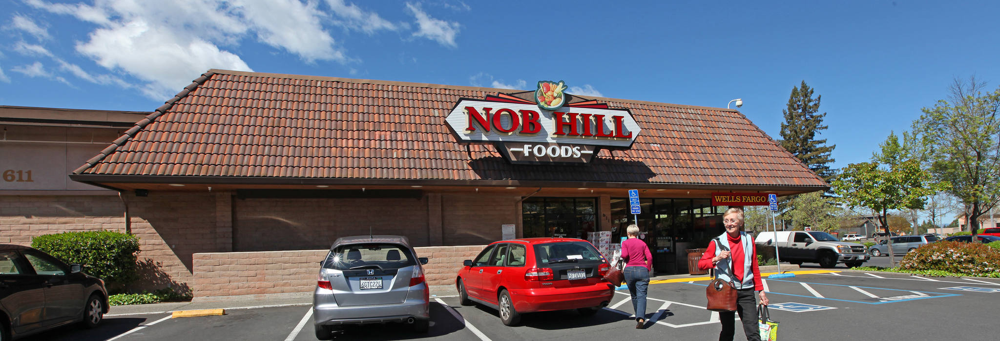
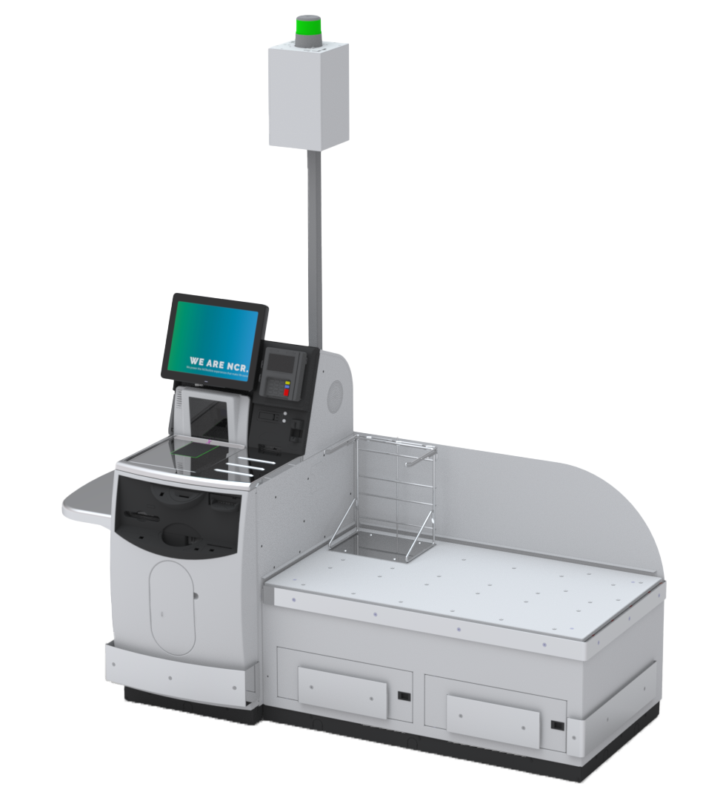
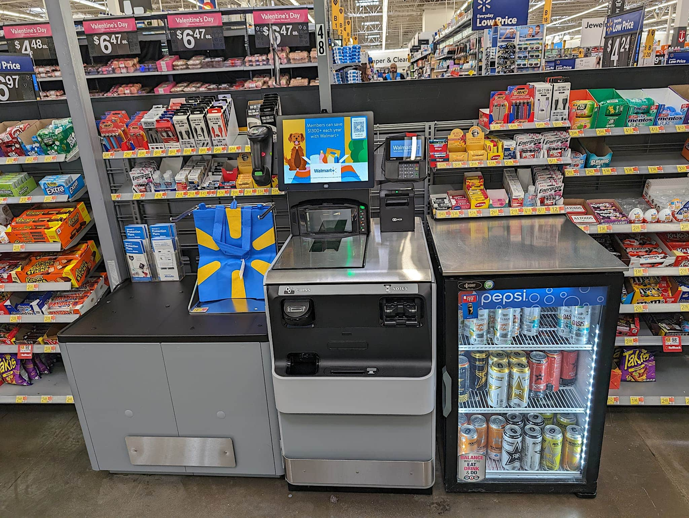

# Self-Checkout Frustrations

Whenever I’m back home in Napa, my choice for food shopping is almost always Nob Hill Foods. I’ve come to expect reliable service from it, and they usually have everything I need for my trip. It’s a large enough store to accommodate most things you’d need for a conventional grocery store trip.

Up until just recently however, I ran into something obnoxious about the store, and it made me wish things were better. The issues I had were eventually fixed, but I’ll go over that later.

My issue was with their self-checkout machines. Usually, they weren’t too bad to interact with when you had a very small number of items. They were a nice way to skip needing to wait for a proper check stand to open if you didn’t have too much stuff with you. 

Problems arose with larger orders. Sometimes, it’ll just be inescapably busy in the store at times, particularly around holidays, and that makes getting in and out difficult. This is where I tried to give self-checkout a shot while the regular check stand lines were quite long. 

I went to the self-checkout, and things went as normal, until I got to the produce items. Under the screen, there’s a little square that you scan your items on. It also serves as the scale as well, which you need for produce since they’re by weight and not amount. The scale was rather finicky, and it’s a bit small as well, so getting everything to fit was a bit of an issue. It must’ve read the weight wrong, because it gave me an error when setting down the product in the bagging area from a weight mismatch. I had to wait for someone to come over and clear my screen so I could continue. This can take a while depending on how busy the store is. I get it cleared, and I continue. It happens again near the end of my order, not much you can do there besides waiting again. In addition to all this, you must scan each item one at a time, putting it down in the bagging area. You can’t scan multiple items before setting them down, as the machine would lock up if you don’t set the item down in the bagging area right after scanning, so I had to take it slow.

Finally, I finish checking everything out, and it asks me if I brought my own bags or if I wanted to buy some. I brought some with me this time, so I say I have my own. This causes the machine to lock up again, requiring yet another approval from an employee. Finally, I’m able to get my stuff paid for and bagged, and I get out of there. Something that should’ve been a quick and easy experience had been dragged out and made frustrating to use from things that weren’t even my fault. If I had done something to directly cause the errors, then it would’ve been more understandable. It just felt like the machine would stop working properly at random.

My **mental model** expected another simple and easy experience with using the self-checkout, based upon my previous experiences I had with using self-checkout in the past. This was not the case this time.

> This Walmart self-checkout is the same model that Nob Hill Foods has.

Thankfully, the experience I had with it recently was much better. I was in another situation where I went through self-checkout with a handful of items to avoid the wait from the regular lines. Things were much smoother and easier this time. You could scan multiple items without needing to immediately set them down, it didn’t lock up anymore if there was a weight imbalance, and having your own bags didn’t require approval anymore. Every frustrating experience I had with using self-checkout was seemingly gone, providing a much more **efficient and satisfying** user experience. I had always heard negative comments about self-checkout in the past and got an understanding of why people felt that way from my experience. With those changes, I’m confident that perception over self-checkout will be much better, now that the experience has been improved so much.

